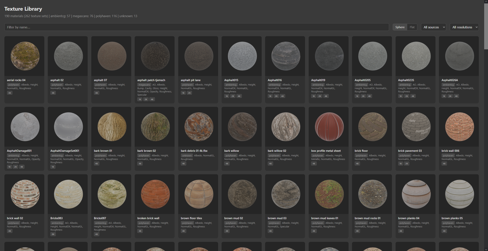
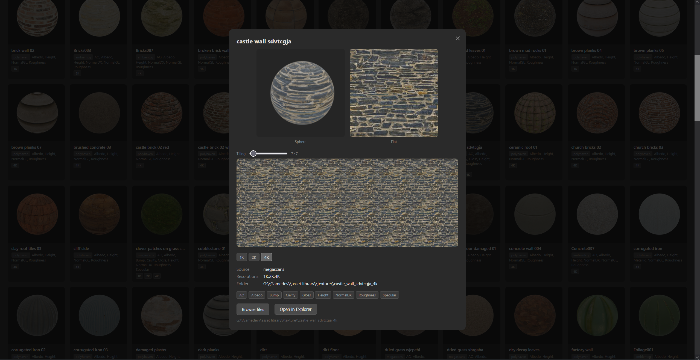

# AssetManager

Python CLI tool for managing a game dev texture library. Scans PBR texture sets from mixed sources (PolyHaven, AmbientCG, Megascans, etc.), generates sphere preview thumbnails, ~~and exports Unity-ready material folders~~.





## Quick Start

```bash
# Install (from repo root)
pip install -e . --user

# Or just run directly without installing:
cd src
python -m asset_manager.cli scan
```

Or use the **batch files** (double-click from Explorer):

| Batch file | What it does |
|---|---|
| `Scan Library.bat` | Scan texture library → `output/catalog.json` |
| `Generate Thumbnails.bat` | Render PBR sphere thumbnails using Blender (cached) |
| `Open Gallery.bat` | Regenerate gallery, start local server, open browser |
| `Export for Unity.bat` | Export all textures as Unity-ready material folders |

### CLI examples

```bash
# Scan your library → writes output/catalog.json
assetmgr scan

# Generate PBR sphere thumbnails (requires Blender 5.0)
assetmgr thumbnails

# Generate HTML gallery
assetmgr gallery

# Serve gallery with browse & Explorer integration
assetmgr serve

# Export a specific texture for Unity
# assetmgr unity-export --name cobblestone

# Export everything
# assetmgr unity-export
```

## Commands

| Command | What it does |
|---|---|
| `scan` | Index the texture library → `output/catalog.json` with map types, sources, metadata |
| `gallery` | Generate a self-contained `output/gallery.html` with search & filter |
| `thumbnails` | Render PBR sphere previews via Blender headless (cached — only renders new) |
| `serve` | Start a local server for the gallery with Browse Files & Open in Explorer |
| ##`unity-export` | Copy & rename maps into Unity-standard folders you can drop into `Assets/` |

## Gallery Features

The HTML gallery (`Open Gallery.bat`) includes:

- **Sphere / Flat toggle** — switch all card thumbnails between PBR sphere renders and flat albedo crops
- **Search & filter** — filter by name, source (PolyHaven / AmbientCG / Megascans), or resolution
- **Detail modal** — click any card to see both previews at a larger size, map types, source, and resolution info
- **Resolution switcher** — when a texture has multiple resolutions (1K/2K/4K), click the tags in the modal to switch between them
- **Tiling preview** — see how a texture tiles, with drag-to-pan and scroll-to-zoom
- **Browse Files** — opens a server-side directory listing where image files are clickable for full-size preview
- **Open in Explorer** — opens the texture folder directly in Windows Explorer

The gallery server auto-kills any stale process on port 8271 when restarted via the batch file.

## Configuration

Edit `config.yaml` to set your paths:

```yaml
paths:
  texture_library: "G:\\Gamedev\\asset library\\texture"
  output: "./output"
  blender: "C:\\Program Files\\Blender Foundation\\Blender 5.0\\blender.exe"

#unity_export:
  render_pipeline: "URP"
  preferred_resolution: "2K"~~
```

All commands accept `--path` and `--output` overrides.

## Supported Sources

The scanner auto-detects the texture provider and normalizes map naming:

| Source | Folder pattern | Map naming | Extras |
|---|---|---|---|
| PolyHaven | `name_4k.blend` | `_diff`, `_nor_gl`, `_rough`, `_disp` | `.blend` file included |
| AmbientCG | `Name_4K-JPG` | `_Color`, `_Roughness`, `_NormalGL` | Preview `.png`, `.blend`, `.usdc` |
| Megascans | `name_hashcode_4k` | `_BaseColor`, `_Normal`, `_Roughness` | `.json` metadata with categories |

~~## Unity Export~~

`unity-export` ~~creates folders like:~~

```
output/unity/
├── Cobblestone_01/
│   ├── Cobblestone_01_Albedo.jpg
│   ├── Cobblestone_01_Normal.exr
│   ├── Cobblestone_01_Height.png
│   └── Cobblestone_01_Roughness.jpg
├── Castle_Wall/
│   ├── ...
```

~~These can be copied directly into your Unity project's `Assets/Textures/` folder. Unity imports them without complaint.~~

## Requirements

- Python 3.9+
- Pillow (`pip install Pillow`) — for flat albedo-crop thumbnails
- Jinja2 (`pip install Jinja2`) — template rendering
- PyYAML (`pip install pyyaml`) — config loading
- Blender 5.0 (only for `thumbnails` command — everything else works without it)
